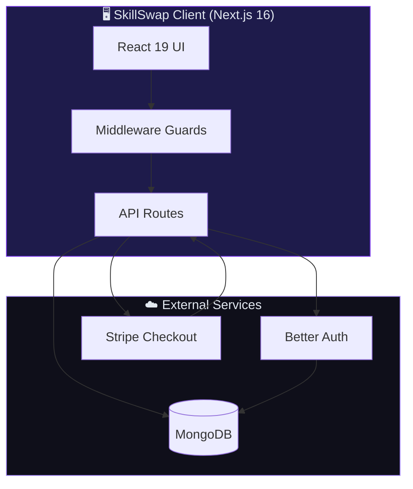

<div align="center">

<!-- Animated SVG Banner -->
<svg xmlns="http://www.w3.org/2000/svg" viewBox="0 0 800 200" width="100%" style="max-width:800px">
  <defs>
    <linearGradient id="bgGrad" x1="0%" y1="0%" x2="100%" y2="100%">
      <stop offset="0%" style="stop-color:#0f0f1a">
        <animate attributeName="stop-color" values="#0f0f1a;#1a0a2e;#0f0f1a" dur="6s" repeatCount="indefinite"/>
      </stop>
      <stop offset="50%" style="stop-color:#2d1b69">
        <animate attributeName="stop-color" values="#2d1b69;#4c1d95;#2d1b69" dur="6s" repeatCount="indefinite"/>
      </stop>
      <stop offset="100%" style="stop-color:#0f0f1a">
        <animate attributeName="stop-color" values="#0f0f1a;#1e1035;#0f0f1a" dur="6s" repeatCount="indefinite"/>
      </stop>
    </linearGradient>
    <linearGradient id="textGrad" x1="0%" y1="0%" x2="100%" y2="0%">
      <stop offset="0%" style="stop-color:#a78bfa"/>
      <stop offset="50%" style="stop-color:#7C3AED"/>
      <stop offset="100%" style="stop-color:#c4b5fd"/>
    </linearGradient>
    <filter id="glow">
      <feGaussianBlur stdDeviation="3" result="coloredBlur"/>
      <feMerge><feMergeNode in="coloredBlur"/><feMergeNode in="SourceGraphic"/></feMerge>
    </filter>
  </defs>
  <rect width="800" height="200" rx="16" fill="url(#bgGrad)"/>
  <!-- Floating orbs -->
  <circle cx="120" cy="60" r="40" fill="#7C3AED" opacity="0.15">
    <animate attributeName="cy" values="60;80;60" dur="4s" repeatCount="indefinite"/>
    <animate attributeName="opacity" values="0.15;0.25;0.15" dur="4s" repeatCount="indefinite"/>
  </circle>
  <circle cx="680" cy="140" r="55" fill="#a78bfa" opacity="0.1">
    <animate attributeName="cy" values="140;120;140" dur="5s" repeatCount="indefinite"/>
    <animate attributeName="opacity" values="0.1;0.2;0.1" dur="5s" repeatCount="indefinite"/>
  </circle>
  <circle cx="400" cy="30" r="25" fill="#7C3AED" opacity="0.2">
    <animate attributeName="r" values="25;30;25" dur="3s" repeatCount="indefinite"/>
  </circle>
  <!-- Logo icon -->
  <g transform="translate(340, 55)" filter="url(#glow)">
    <rect x="0" y="0" width="50" height="50" rx="12" fill="#7C3AED" opacity="0.9">
      <animate attributeName="opacity" values="0.9;1;0.9" dur="2s" repeatCount="indefinite"/>
    </rect>
    <text x="25" y="34" text-anchor="middle" fill="white" font-size="24" font-weight="bold" font-family="sans-serif">S</text>
  </g>
  <text x="400" y="145" text-anchor="middle" fill="url(#textGrad)" font-size="42" font-weight="bold" font-family="sans-serif" filter="url(#glow)">SkillSwap</text>
  <text x="400" y="175" text-anchor="middle" fill="#94a3b8" font-size="14" font-family="sans-serif" letter-spacing="4">FREELANCE MICRO-TASK PLATFORM</text>
</svg>

<br/>

[](https://skillswap-two-psi.vercel.app)
[](https://github.com/fahimuntasin/skillswap-server)

<br/>

[](https://nextjs.org)
[](https://react.dev)
[](https://www.typescriptlang.org)
[](https://tailwindcss.com)
[](https://www.mongodb.com)
[](https://stripe.com)
[](https://www.better-auth.com)

<br/>

<!-- Typing SVG -->
[](https://git.io/typing-svg)

</div>

---

## ✨ About SkillSwap

**SkillSwap** is a full-stack freelance marketplace where **clients** post micro-tasks — logo design, article writing, bug fixes — and **freelancers** compete with proposals to get hired. Built for assignment **A10_CAT-011**, it demonstrates production-grade auth, role-based dashboards, Stripe payments, and a polished dark/purple UI.

> 🎯 A simpler, faster alternative to Fiverr — focused on quick, one-time jobs.

---

## 🌟 Key Features

<table>
<tr>
<td width="50%">

### 🔐 Authentication
- Email/password + **Google OAuth**
- Better Auth with MongoDB adapter
- Role-based redirects (Client → home, Freelancer/Admin → dashboard)
- Google sign-up always creates **Client** accounts

### 💳 Payments
- **Stripe Checkout** integration
- Payment confirmation before work starts
- Transaction history & admin revenue analytics

### 📋 Task Marketplace
- Browse, search & filter by category
- Server-side pagination (9 per page)
- Task detail pages with proposal submission
- Bookmarks & notifications

</td>
<td width="50%">

### 👥 Role Dashboards
- **Client** — post tasks, review proposals, pay & rate
- **Freelancer** — apply, deliver work, track earnings
- **Admin** — manage users, tasks, transactions

### 🎨 UI / UX
- Dark/light theme (`#7C3AED` brand purple)
- Fully responsive (mobile → desktop)
- GSAP + Framer Motion animations
- shadcn/ui + HeroUI components

### 🛡️ Security
- JWT session cookies
- `/dashboard/*` middleware guards
- API **403** on wrong-role access
- All secrets in `.env.local`

</td>
</tr>
</table>

---

## 🏗️ Architecture



---

## 🔄 How It Works

```
  ① Client posts task          ② Freelancers apply with proposals
         │                                │
         ▼                                ▼
  ③ Client hires freelancer    ④ Stripe Checkout payment
         │                                │
         ▼                                ▼
  ⑤ Freelancer delivers work   ⑥ Client rates & reviews
```

---

## 📦 Tech Stack

| Layer | Technology |
|-------|-----------|
| **Framework** | Next.js 16 (App Router) |
| **Language** | TypeScript 5 |
| **UI** | React 19, Tailwind CSS 4, shadcn/ui, HeroUI |
| **Animation** | GSAP, Framer Motion |
| **Auth** | Better Auth + `@better-auth/mongo-adapter` |
| **Database** | MongoDB + Mongoose |
| **Payments** | Stripe |
| **Forms** | React Hook Form + Zod |
| **Icons** | Lucide React, Heroicons |

---

## 🚀 Getting Started

### Prerequisites

- Node.js 18+
- MongoDB instance (local or Atlas)
- Stripe test keys
- Google OAuth credentials (optional)

### Installation

```bash
# Clone the repository
git clone https://github.com/fahimuntasin/skillswap-client.git
cd skillswap-client

# Install dependencies
npm install

# Configure environment variables
cp .env.example .env.local   # or create .env.local manually
# Edit .env.local with your values (see below)

# Seed admin user (optional)
npx tsx src/scripts/seed.ts

# Start development server
npm run dev
```

Open [http://localhost:3000](http://localhost:3000) in your browser.

### Environment Variables

| Variable | Description |
|----------|-------------|
| `MONGODB_URI` | MongoDB connection string |
| `BETTER_AUTH_SECRET` | Random secret for auth sessions |
| `BETTER_AUTH_URL` | App URL (e.g. `http://localhost:3000`) |
| `GOOGLE_CLIENT_ID` | Google OAuth client ID |
| `GOOGLE_CLIENT_SECRET` | Google OAuth client secret |
| `STRIPE_SECRET_KEY` | Stripe secret key (server-side) |
| `NEXT_PUBLIC_STRIPE_PUBLISHABLE_KEY` | Stripe publishable key |
| `NEXT_PUBLIC_CLIENT_URL` | Deployed frontend URL |

> ⚠️ Never commit `.env.local` or expose secret keys.

---

## 🧪 Test Accounts

| Role | Email | Password |
|------|-------|----------|
| Admin | `admin1@taskhive.com` | `admin1@taskhive.com` |

---

## 📁 Project Structure

```
skillswap-client/
├── src/
│   ├── app/                  # Next.js App Router pages & API routes
│   │   ├── (auth)/           # Login & register
│   │   ├── dashboard/        # Role-based dashboards
│   │   ├── tasks/            # Task browsing
│   │   ├── freelancers/      # Freelancer profiles
│   │   └── api/              # REST API endpoints
│   ├── components/           # Reusable UI components
│   ├── lib/                  # Auth, DB, utilities
│   └── scripts/              # Seed & maintenance scripts
├── public/                   # Static assets
└── middleware.ts             # Route protection
```

---

## 📊 GitHub Stats

<div align="center">


</div>

---

## 🔗 Links

| Resource | URL |
|----------|-----|
| 🌐 **Live Demo** | [skillswap-two-psi.vercel.app](https://skillswap-two-psi.vercel.app) |
| 🖥️ **Backend Repo** | [github.com/fahimuntasin/skillswap-server](https://github.com/fahimuntasin/skillswap-server) |
| 📋 **Assignment** | A10_CAT-011 — Freelance Micro-Task Platform |

---

<div align="center">

**Built with 💜 using Next.js, Better Auth, MongoDB & Stripe**

<sub>SkillSwap © 2026 · Freelance Micro-Task Platform</sub>

</div>
